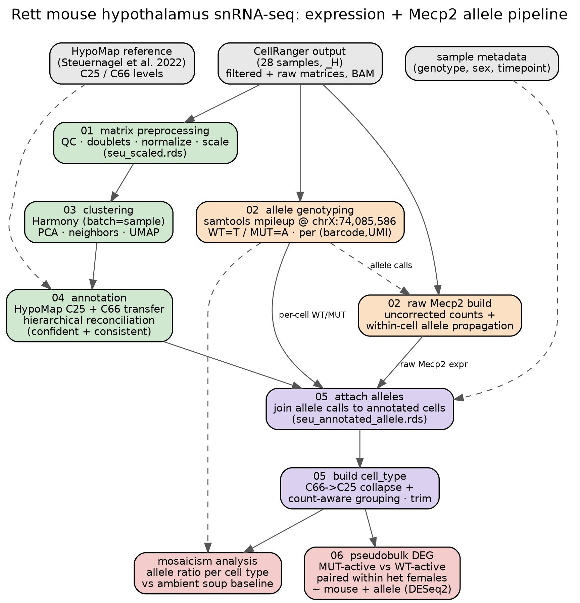

# Rett_mouse_hypo

Longitudinal single-nucleus RNA-seq analysis of a *Mecp2* Rett syndrome mouse
model in the hypothalamus, resolving **per-cell wild-type vs mutant *Mecp2*
allele identity** and using it for cell-type-resolved differential expression and
X-inactivation mosaicism analysis.



## Overview

The mutant *Mecp2* allele in this model differs from wild-type by a **single base**:
the e1 start codon `ATG -> TTG` (mm10 chrX:74,085,586; *Mecp2* is minus-strand, so
on the + strand wild-type reads **T** and mutant reads **A**). Because that is the
only sequence difference, allele identity can only be read from reads spanning that
base. The pipeline runs two tracks that meet at a single annotated object:

- **Expression track** – ambient-corrected, batch-integrated clustering and
  HypoMap-based cell-type annotation.
- **Allele track** – barcode-aware genotyping at the start codon, with within-cell
  propagation (one SNP-covering read fixes a cell's allele, so its whole *Mecp2*
  count is attributed to that allele; biallelic expression is negligible under XCI).

They converge into `seu_final.rds`, which carries both cell-type labels and per-cell
allele calls, ready for differential expression and mosaicism analysis.

## Repository layout

```
01_matrix_preprocessing/     QC, doublet removal, normalization, scaling -> seu_scaled.rds
02_allele_genotyping/        SNP genotyping (samtools) + raw uncorrected Mecp2 build
03_clustering/               Harmony integration, PCA, clustering, UMAP
04_annotation/               HypoMap C25 + C66 transfer, hierarchical reconciliation
05_celltype_allele/          attach allele calls, build cell_type column, trim metadata
06_differential_expression/  paired pseudobulk DEG (MUT-active vs WT-active)
env/                         conda spec + activation
slurm/                       SLURM wrappers (one per stage)
docs/                        pipeline schematic (.dot/.pdf/.jpg)
config.sh                    all paths and parameters in one place
run_pipeline.sh              end-to-end submission with dependencies
```

## Setup

1. **Environment** (R/Seurat/harmony/DESeq2 + samtools + python in one conda env):

   ```bash
   conda env create -f env/environment.yml -p /path/to/envs/rett_hypo
   conda activate /path/to/envs/rett_hypo
   Rscript -e 'install.packages("SoupX", repos="https://cloud.r-project.org")'  # CRAN-only
   ```

2. **Configure paths** – edit `config.sh` (CellRanger output, object dir, HypoMap,
   sample metadata, SLURM account/qos). Every script and SLURM job sources it.

3. **Reference** – download HypoMap (Steuernagel et al., *Nat Metab* 2022) as a
   Seurat `.rds`, then derive the hierarchy map once:

   ```bash
   Rscript 04_annotation/make_c25_c66_map.R "$HYPOMAP" "$C25C66_MAP"
   ```

## Running

`01_matrix_preprocessing/` must have produced `seu_scaled.rds` first. Then:

```bash
bash run_pipeline.sh      # submits all stages with SLURM dependencies
```

Or run stages individually (see `slurm/*.sbatch`). Submission order and dependencies:

| Stage | Script | Input | Output |
|-------|--------|-------|--------|
| 02 genotype | `genotype_mecp2.py` | BAM per sample | `<sample>.mecp2_allele.csv` |
| 02 raw Mecp2 | `raw_mecp2_build.R` | CellRanger matrices | `mecp2_raw.rds` |
| 03 cluster | `cluster.R` | `seu_scaled.rds` | `seu_clustered.rds` |
| 04 annotate | `annotate_hypomap.R` | `seu_clustered.rds` + HypoMap | `seu_annotated_C25_named.rds`, `..._C66_named.rds` |
| 04 hier | `hierarchical_labels.R` | both annotated objects | `seu_annotated_hier.rds` |
| 05 attach | `attach_alleles.R` | hier object + allele CSVs | `seu_annotated_allele.rds` |
| 05 cell_type | `make_celltype.R` | allele object | `seu_final.rds` |
| 06 DEG | `pseudobulk_deg.R` | `seu_final.rds` | `DEG_mosaic_female/` |

## Method notes

**Genotyping.** `samtools mpileup --output-extra CB,UB` at the SNP, deduplicated per
`(cell barcode, UMI)`, tallied WT vs MUT per barcode. An `AMBIENT` row per sample
captures the soup allele ratio as a contamination baseline. All barcodes are kept,
including ambient, so single-cell calls can be read against the soup.

**Allele propagation.** With a purity threshold (default 0.75), a cell's allele is
fixed by its SNP-covering reads; its full raw *Mecp2* UMI count is then attributed to
that allele (`mecp2_allele_expr_wt/_mut`). Cells with both alleles at the SNP are
labelled `conflicted` (doublets/artifacts) and excluded.

**Annotation.** Cell types are transferred from HypoMap at two granularities (C25,
C66). A cell keeps its fine C66 label only where it is both **confident** (transfer
score above a data-driven cutoff) and **consistent** (its C66 type nests under its
predicted C25 parent per the hierarchy map); otherwise it falls back to C25. This
removes confidence artifacts where the same cells split between a named C66 subtype
and their unnamed C25 parent.

**Differential expression.** MUT-active vs WT-active cells are compared **within het
females** (both alleles occur in the same animal via X-inactivation), aggregated to
**pseudobulk per (animal × cell type × allele)** and tested with DESeq2 under
`~ mouse + allele`. Blocking on animal removes animal/batch/age/dissection effects;
pseudobulk avoids treating cells from one mouse as independent replicates. Positive
log2FC = higher in MUT-active (MeCP2-deficient) cells.

**Selection caveat.** A cell is allele-callable only if it has a *Mecp2* read over the
start codon, so tested cells are enriched for *Mecp2* expressors. The MUT-vs-WT
contrast is internally symmetric, but absolute-expression statements inherit this
selection.

## Data & reference availability

- snRNA-seq: 28 hypothalamus samples (`*_H`), males P30/P60/P120, females P30/P60/P150.
- Alignment: CellRanger, mm10 / GRCm38 (`refdata-cellranger-mm10-3.0.0`).
- Reference atlas: HypoMap — Steuernagel et al., *Nature Metabolism* 2022.

## Reproducibility

All parameters live in `config.sh`; the environment is pinned in
`env/environment.yml`; the schematic is regenerated from `docs/pipeline_schematic.dot`.
Objects and figures are git-ignored (regenerated by the pipeline). Set a seed in R
sessions for exact clustering/UMAP reproduction.
